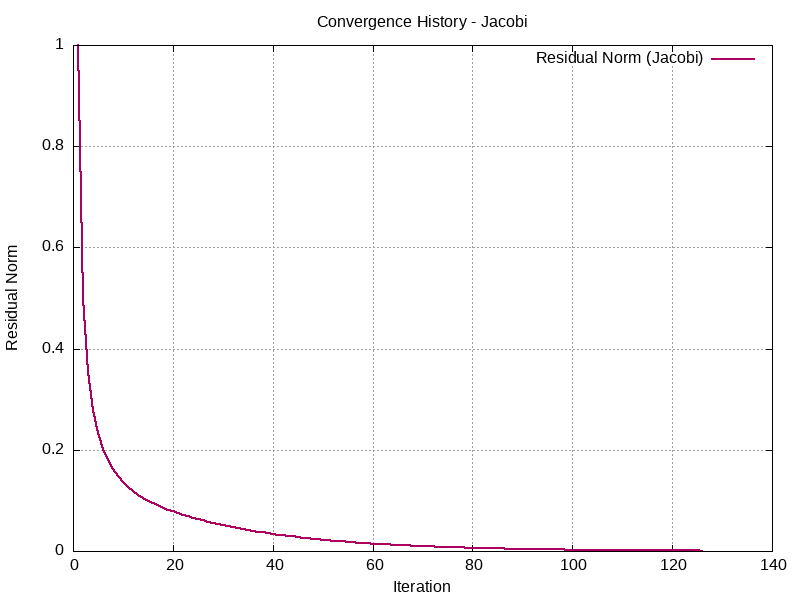
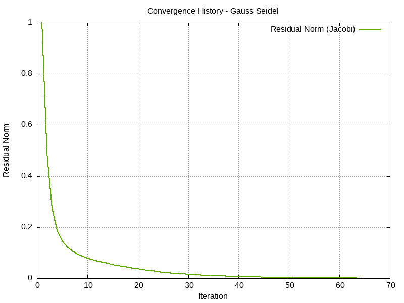

# Rapport : Résolution numérique de l'équation de la chaleur

## **Introduction**

L'objectif de ce travail est de résoudre numériquement l'équation de la chaleur dans un milieu statique. Cette équation sera discrétisée à l'aide de méthodes de différences finies. Le problème est défini par les équations suivantes :

$$
-k \frac{\partial^2 T}{\partial x^2} = g, \quad x \in ]0, 1[
$$
$$
T(0) = T_0, \quad T(1) = T_1
$$

Dans notre cas, $ g = 0 $, et la solution analytique de ce problème est donnée par :
$$
T(x) = T_0 + x(T_1 - T_0)
$$

Le rapport détaille les étapes de la discrétisation, la mise en œuvre numérique avec des bibliothèques C telles que BLAS et LAPACK, et la validation des résultats.

---

## **1. Discrétisation du problème**

### 1.1 Approximations numériques

Le domaine $[0, 1]$ est discrétisé en $ n+2 $ nœuds espacés uniformément par un pas $ h = \frac{1}{n+1} $. Aux nœuds internes, la dérivée seconde est approximée par un schéma centré d'ordre 2 :
$$
\frac{\partial^2 T}{\partial x^2} \Big|_i \approx \frac{T_{i-1} - 2T_i + T_{i+1}}{h^2}
$$

En remplaçant cette approximation dans l'équation de la chaleur, nous obtenons un système linéaire tridiagonal :
$$
A u = f
$$
ou :
- $ A $ est une matrice tridiagonale définie par :
  $$
  A =
  \begin{bmatrix}
  2 & -1 &  0 & \dots & 0 \\
  -1 &  2 & -1 & \dots & 0 \\
  \dots & \dots & \dots & \dots & \dots \\
  0 & \dots & -1 &  2
  \end{bmatrix}
  $$
- $ u $ est le vecteur des températures $ [T_1, T_2, \dots, T_n]^T $,
- $ f $ est le vecteur source (ici $ f = 0 $).

### 1.2 Conditions aux bords

Les températures aux extrémités $ T_0 $ et $ T_1 $ sont imposées par les conditions aux limites. Ces valeurs sont utilisées dans les calculs pour compléter la matrice $ A $ et le vecteur $ f $.

---

## **2. Stockage bande**

### 2.1 Définition

Les matrices tridiagonales peuvent être efficacement stockées sous forme compacte en utilisant le stockage par bande. Ce format représente uniquement les diagonales significatives :
$
\text{AB} =
\begin{bmatrix}
  0 & -1 & -1 & -1 & \dots \\
  2 &  2 &  2 &  2 & \dots \\
 -1 & -1 & -1 & -1 & \dots
\end{bmatrix}
$

Les éléments de la matrice $ A $ sont placés dans le tableau $ \text{AB} $ selon les indices définis par LAPACK :
$$
\text{AB}[kl + ku + 1 + i - j, j] = A[i, j]
$$

### 2.2 Exemple avec $ n = 5 $

Pour une matrice tridiagonale avec \( n = 5 \), \( kl = 1 \), et \( ku = 1 \), le stockage par bande est illustré par :
$
A =
\begin{bmatrix}
2 & -1 &  0 &  0 &  0 \\
-1 &  2 & -1 &  0 &  0 \\
 0 & -1 &  2 & -1 &  0 \\
 0 &  0 & -1 &  2 & -1 \\
 0 &  0 &  0 & -1 &  2
\end{bmatrix}
$
$
\text{AB} =
\begin{bmatrix}
0 & -1 & -1 & -1 &  0 \\
2 &  2 &  2 &  2 &  2 \\
-1 & -1 & -1 & -1 &  0
\end{bmatrix}
$

---

# **Exercice 3 : Référence et utilisation de BLAS/LAPACK**

## **1. Déclaration et allocation d'une matrice**

- Allouer la matrice au format colonne majeure :
  ```c
  double* A = (double*) malloc(n * m * sizeof(double));
  ```

## **2. Signification de LAPACK\_COL\_MAJOR**

- Indique que la matrice est stockée en **colonne majeure** (colonnes contiguës en mémoire).

## **3. Signification de la dimension principale (ld)**

- **ld** est le nombre d'éléments entre deux entrées successives d'une même colonne.
- Pour une matrice de taille , **ld = n** en stockage colonne majeure.

## **4. Fonction dgbmv**

- Calcule : Produit de matrice-vecteur pour une matrice bande **A**.
- Sa complexité est de $ O(n(kl+ku)) $.

## **5. Fonction dgbtrf**

- Réalise la **factorisation LU** d'une matrice bande  sans permutation des lignes.

## **6. Fonction dgbtrs**

- Résout le système :  après une factorisation LU de .

## **7. Fonction dgbsv**

- Combine **dgbtrf** et **dgbtrs** pour résoudre directement .

## **8. Calcul de la norme du résidu relatif**

1. Calcul du résidu  avec **dgbmv**.

2. Calcul de la norme relative :

3. Utiliser **dnrm2** pour la norme 2.

---

# **Exercice 4 : Stockage GB et appel à DGBMV**

## **1. Stockage GB pour la matrice de Poisson 1D**

- La matrice de Poisson 1D tridiagonale :
  ```
  [  d  u  0  0  0 ]
  [  l  d  u  0  0 ]
  [  0  l  d  u  0 ]
  [  0  0  l  d  u ]
  [  0  0  0  l  d ]
  ```
- Stockage GB (3 lignes et  colonnes) :
  - Ligne 0 : sur-diagonale (u)
  - Ligne 1 : diagonale principale (d)
  - Ligne 2 : sous-diagonale (l)

## **2. Utilisation de dgbmv**

- Appel de **dgbmv** :
  ```c
  dgbmv("N", &n, &n, &kl, &ku, &alpha, AB, &ldab, x, &incx, &beta, y, &incy);
  ```

## **3. Méthode de validation**

- Comparer **dgbmv** avec le produit classique .
- Calculer la norme de la différence avec **dnrm2**.

---

# **Exercice 5 : DGBTRF, DGBTRS, DGBSV**

## **1. Résolution du système linéaire avec LAPACK**
- Utiliser **dgbsv** directement pour résoudre \(A \cdot X = B\) :
  ```c
  dgbsv(&n, &kl, &ku, &nrhs, AB, &ldab, ipiv, B, &ldb, &info);
  ```

---

## **2. Évaluation des performances et complexité**
- **Complexité de dgbtrf** : \(\mathcal{O}(n \cdot (kl + ku)^2)\)
- **Complexité de dgbtrs** : \(\mathcal{O}(n \cdot (kl + ku))\)
- La complexité dépend fortement de la largeur de la bande \((kl + ku)\).

---

# **Exercice 6 : LU pour les matrices tridiagonales**

## **1. Implémentation de la factorisation LU**
- Soit \(A\) une matrice tridiagonale, la factorisation LU suit les étapes suivantes :
  Pour \(k = 1, \ldots, n-1\) :
  - \(L_{k+1, k} = A_{k+1, k} / A_{k, k}\)
  - \(A_{k+1, k+1} = A_{k+1, k+1} - L_{k+1, k} \cdot A_{k, k+1}\)

---

## **2. Méthode de validation**
- Factorisez \(A\) en \(LU\) avec la méthode manuelle.
- Comparez avec la solution fournie par **dgbtrf**.
- Calculer la norme de la différence entre les deux matrices :
  \(\|A - L \cdot U\|\) à l'aide de **dnrm2**.
- Assurez-vous que la norme de l'erreur est proche de zéro.

---

# **Exercice 7 : Implémentation C - Richardson**

## **1. Implémentation en C de l'algorithme de Richardson au format GB**
- L'algorithme de Richardson avec un paramètre $ \alpha $ optimal a été implémenté en utilisant la matrice AB au format GB (General Band), associée au problème 1D de Poisson.
- Le paramètre $ \alpha $ optimal est calculé à l'aide des valeurs propres de la matrice GB, les valeurs propres sont calculées comme suit :
  $$
  \lambda_k = 4 \sin^2\left(\frac{k\pi h}{2}\right), \quad \text{où } k = 1, 2, \dots, la.
  \quad \text{avec } h = \frac{1}{la + 1}
  $$
    ensuite, le paramètre $ \alpha $ optimal est calculé comme suit :
  $$
  \alpha = \frac{2}{\lambda_{\text{max}} + \lambda_{\text{min}}}
  $$
- Le paramètre $ \alpha $ est utilisé tel que chaque itération met à jour la solution $ x $ en fonction du résidu calculé $ r = b - Ax $. Cette mise à jour est réalisée comme suit :
  $$
  x^{(i+1)} = x^{(i)} + \alpha \cdot r^{(i)}.
  $$
    Cela garantit une convergence plus rapide en minimisant l'erreur en fonction des valeurs propres de la matrice.
- Les fonctions CBLAS sont utilisé pour profiter de la matrice au format GB, ce qui rend un code plus optimisé.
- Le résidu à chaque itération est sauvegardé dans un vecteur nommé resvec.
## **2. Calcul de l'erreur par rapport à la solution analytique**
- L'erreur par rapport à la solution analytique (EX_SOL) est calculé avec la fonction relative_forward_error() dans définie dans lib_poisson1D.c.
## **3. Analyse de la convergence**
- L'analyse de la convergence a été réalisée en sauvegardant le vecteur resvec (qui stocke les normes des résidus à chaque itération) ainsi que le nombre d'itérations dans un fichier convergence_history_richardson.dat.
- Les données extraites ont ensuite été utilisées pour tracer l'historique de convergence à l'aide d'un script Gnuplot.



# **Exercice 8 : Implémentation C - Jacobi**

## **1. Implémentation en C de l'algorithme de Jacobi au format GB**
- L'algorithme de Jacobi a été implémenté en utilisant la matrice AB au format GB (General Band), associée au problème 1D de Poisson.
- Dedans le calcul des résidus est le même que dans Richardson car on utilise la même matrice qui est au format GB.
- Le calcul de la solution, lui est différent :
  
  - Dans Jacobi, chaque composante $ X[i] $ est mise à jour indépendamment en utilisant uniquement les valeurs de la solution de l'itération précédente $ X^{(k)} $, contrairement à Richardson où $ X^{(k+1)} $ dépend directement de la matrice entière via le paramètre $ \alpha $.
  
  - L'algorithme de Jacobi isole chaque inconnue $ X[i] $ de l'équation $ AX = B $, et calcule :
    $$
    X[i] = \frac{\text{RHS}[i] - \sum_{j \neq i} A[i][j] \cdot X^{(k)}[j]}{A[i][i]}
    $$
    où $$ \sum_{j \neq i} A[i][j] \cdot X[j] $$ est calculé à partir des sous-diagonales et sur-diagonales de la matrice AB.
  - Cette approche garantit que l'itération $ k+1 $ utilise uniquement les valeurs de $ X $ de l'itération $ k $, respectant la méthode de Jacobi.

- Finalement, Jacobi fait une itération de moins que Richardson. Cela est dû au fait que $ X $ est calculé avant le calcul du résidu dans chaque itération. Une étude comparative en termes de temps sera effectuée plus tard.

## **2. Calcul de l'erreur par rapport à la solution analytique**
- L'erreur par rapport à la solution analytique (EX_SOL) est calculé avec la fonction relative_forward_error() dans définie dans lib_poisson1D.c.
- La précision est le même que Richardson, car les mêmes méthodes du calcul du résidu sont utilisées.

## **3. Analyse de la convergence**
- L'analyse de la convergence a été réalisée en sauvegardant le vecteur resvec (qui stocke les normes des résidus à chaque itération) ainsi que le nombre d'itérations dans un fichier convergence_history_jacobi.dat.
- Les données extraites ont ensuite été utilisées pour tracer l'historique de convergence à l'aide d'un script Gnuplot.


# **Exercice 9 : Implémentation C - Gauss-Seidel**

## **1. Implémentation en C de l'algorithme de Gauss-Seidel au format GB**
- L'algorithme de Gauss-Seidel a été implémenté en utilisant la matrice AB au format GB (General Band), associée au problème 1D de Poisson.
- Dans cette méthode, le calcul des résidus est le même que celui utilisé pour Jacobi (même fonction).
- Le calcul de la solution, lui est différent :
  - Contrairement à Jacobi, Gauss-Seidel met à jour chaque composante $ X[i] $ en place, ce qui signifie que les nouvelles valeurs calculées pour $ X[i] $ sont immédiatement utilisées dans les calculs des composantes suivantes.
  - L'algorithme exploite la décomposition $ A = D - E - F $, où :
    - $ D $ est la diagonale principale.
    - $ E $ est la sous-diagonale.
    - $ F $ est la sur-diagonale.
  - L'équation $ (D - E) X^{(k+1)} = F X^{(k)} + \text{RHS} $ est résolue à chaque itération, ce qui revient à :
    $$
    X[i] = \frac{\text{RHS}[i] - \sum_{j < i} A[i][j] \cdot X^{(k+1)}[j] - \sum_{j > i} A[i][j] \cdot X^{(k)}[j]}{A[i][i]}
    $$
    - Le terme $ \sum_{j < i} A[i][j] \cdot X^{(k+1)}[j] $ utilise les nouvelles valeurs calculées dans l'itération courante.
    - Le terme $ \sum_{j > i} A[i][j] \cdot X^{(k)}[j] $ utilise les anciennes valeurs.


- Finalement, Gauss-Seidel fait 2x moins d'itérations que Jacobi et Richardson. Cela est dû au fait qu'il utilise les mises à jour immédiates des composantes $ X[i] $ dans chaque itération. Une étude comparative en termes de temps sera effectuée plus tard.
- Cette méthode exploite mieux la dépendance des inconnues entre elles, mais peut être moins efficace pour les systèmes mal conditionnés.

---

## **2. Calcul de l'erreur par rapport à la solution analytique**
- L'erreur par rapport à la solution analytique (EX_SOL) est calculé avec la fonction relative_forward_eror() dans définie dans lib_poisson1D.c.
- La précision est similaire à Jacobi et Richardson.

---

## **3. Analyse de la convergence**
- L'analyse de la convergence a été réalisée en sauvegardant le vecteur resvec (qui stocke les normes des résidus à chaque itération) ainsi que le nombre d'itérations dans un fichier convergence_history_jacobi.dat.
- Les données extraites ont ensuite été utilisées pour tracer l'historique de convergence à l'aide d'un script Gnuplot.

